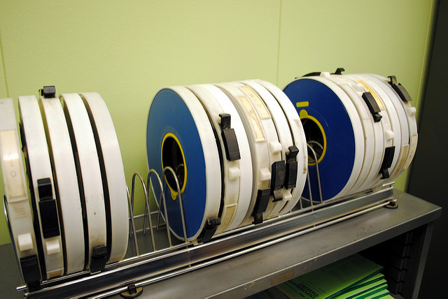

**Friday October 6, 2017**  
Andrew Davis  

Conact Me: 

## Preserving Knowledge 

Digital media has made information more convenient and more accessible. It has made knowledge available to groups that couldn't have imagined it 50 years ago. However, digital media presents a problem that books in libraries never had: Even if data has layers of redundancy and never loses fidelity, there is a good chance that no device or software will be able to interpret it in 500 years. 

You can pick up an English book published in 1600 and read it today. You might have trouble with the vernacular and the font/typeface employed in the book, and parts of it may be unreadable due to natural decomposition of the page, but you'll still be able to read it. However, if you came across the following, what would you do?

  
(CC-BY-SA, (https://www.flickr.com/photos/fastlizard4/6293910323/) )

You would probably have a hard time. That's not to say that there's nothing that can read these tapes around today, but this was a common medium through the 1980s: less than 40 years have passed, and you would have to put a lot of effort into accessing this data. Can you imagine scholars in 400 years trying to access it? 

Here are some interesting readings for you:

- [The Independent: Digital Dark Age](http://www.independent.co.uk/life-style/gadgets-and-tech/news/digital-dark-age-could-leave-historians-with-no-records-of-the-21st-century-10043516.html)
- [Ensuring the Longevity of Digital Information by Jeff Rothenberg](assets/ensuring.pdf)
- [Wired: Five Obsolete Storage Formats](https://www.wired.com/2008/06/five-obsolete-s/)
- [Slashdot Thread: Obsolete File Formats](https://ask.slashdot.org/story/05/08/30/2249225/Examples-of-Obsolete-File-Formats)

---

## Text vs. Multimedia
Another way of looking at this issue is by thinking about text vs. video (or other media) in content distribution today. There is a trend affecting everything from online newspapers to college course materials that increasingly privileges video over text. In fact, if you search "Is video better than text" (go ahead, do it!), almost all of the results focus on how video is a more effective marketing tool and has a stronger ROI. There are also several articles that suggest that Generation Y prefers video over text.

Do you think that's the case? 

Consider [this article](https://simplystatistics.org/2017/06/13/the-future-of-education-is-plain-text/) in the context of our discussion about obsolete storage media. 

There is, however, UX research that [suggests the opposite](http://idratherbewriting.com/2011/07/22/a-few-notes-from-usability-testing-video-tutorials-get-watched-text-gets-skipped/).

Can you think of examples where one format is better than the other? Which is better for long-term preservation of information and knowledge? 

---

## Activity

1. Find one example of data/information/knowledge that has been lost due to obsolete storage media. In hindsight, what would have been a more effective way to store that knowledge? 

